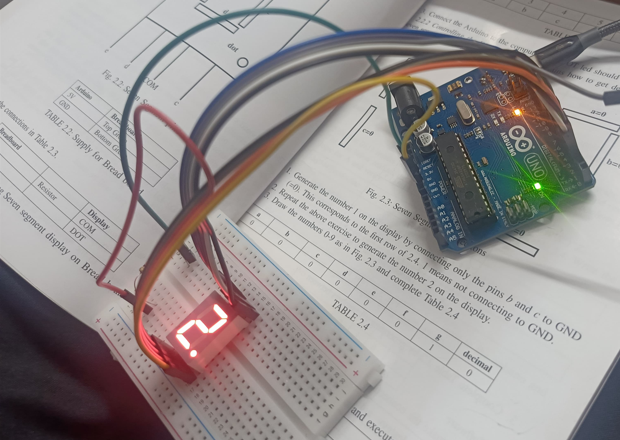
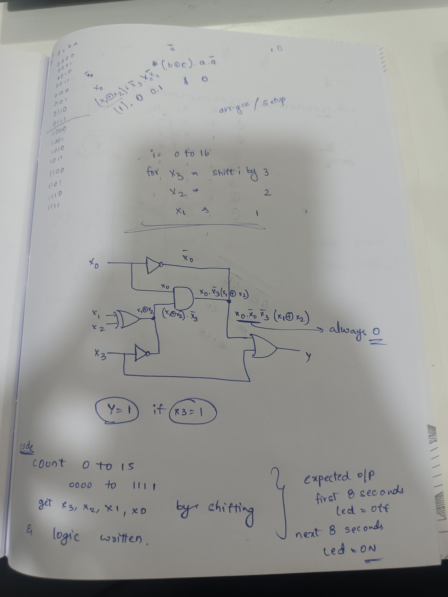
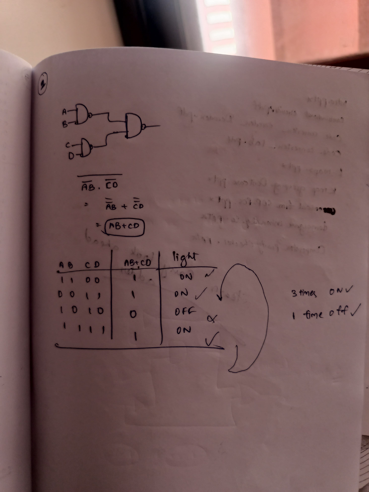
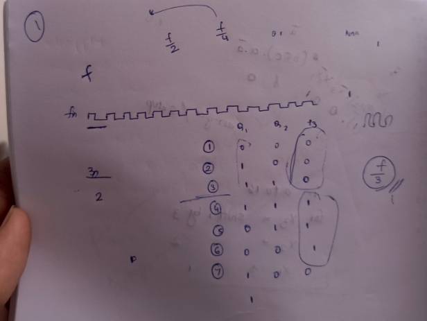

---

## 1. PlatformIO + Arduino Projects ⚙️

Set up embedded projects on Arduino using PlatformIO. Verified LED blinks, serial monitoring, and pin toggling.


---

## 2. Embedded C and Assembly on Arduino 💻

Wrote, compiled, and tested:
- Embedded C code on Arduino
- AVR-gcc Assembly integrated into Arduino IDE

---

## 3. Seven Segment Projects 🔢

Used 7447 (BCD to 7-segment decoder) and 7474 (flip-flops) to build:
- Binary counters
- Decoders
- Logic circuit integrations



---


## 4. GATE-Level Assignments 📘

Solved digital logic problems from GATE, including:
- Flip-flops
- implemented logic simplification questions with arduino, avr-gcc and assembly level programming
- logic simplifications

Each solution was backed with diagrams, truth tables, and verification.







---

## 5. Raspberry Pi + VAMAN + Termux Workflow 🔁

### 📱 Termux + Android Setup:
- Used Termux to write Verilog code, use Git, and sync with Raspberry Pi.
- SSH and SCP used for seamless phone-to-Pi transfer.


---

## 6. Automation & Networking Projects 🔐

### 🤖 Telegram Bot:
- Built a Telegram bot using Python on Raspberry Pi.
- Functions include remote command handling, GPIO control, message parsing, etc.
- Automated actions like turning on/off LEDs or sending status.


### 🌐 Pi-hole (Network-wide Ad Blocking):
- Installed and configured Pi-hole on Raspberry Pi.
- Set up DNS filtering for entire network.
- Blacklists, custom domains, and analytics configured via admin dashboard.


---


## ✅ Project Highlights

- [x] PlatformIO Arduino Projects  
- [x] Embedded C + Assembly  
- [x] Digital Logic Circuits (IC 7447, 7474)   
- [x] GATE-level Assignments  
- [x] Raspberry Pi SSH + Termux Workflow  
- [x] Telegram Bot Automation  
- [x] Pi-hole DNS Server  

---

## 🛠 Tools & Technologies

- PlatformIO, Arduino IDE  
- Termux, OpenSSH, Git  
- Raspberry Pi 3  
- Vivado, Verilog HDL  
- Pi-hole, Bash  
- Telegram Bot API (Python)

---

# Vaman Board Complete Setup Guide

This repository contains comprehensive implementation guides for programming the Vaman board across three different platforms: ESP32, ARM, and FPGA. The Vaman board is a versatile development platform that combines multiple processing units for embedded systems learning and development.

## Table of Contents

- [Prerequisites](#prerequisites)
- [Initial Setup](#initial-setup)
- [ESP32 Programming](#esp32-programming)
- [ARM Programming](#arm-programming)
- [FPGA Programming](#fpga-programming)
- [Assignment Questions](#assignment-questions)
- [Troubleshooting](#troubleshooting)
- [Resources](#resources)

## Prerequisites

### Hardware Requirements
- Vaman board
- USB cable for programming
- Raspberry Pi (for ARM programming)
- Android device (for mobile setup)
- WiFi network access

### Software Requirements
- F-Droid (Android)
- Termux and Termux-API
- PlatformIO
- Python 3
- Git

## Initial Setup

### Installing Required Apps

1. **Install F-Droid** on your Android device
2. **Open F-Droid** and install the following apps:
   - Termux
   - Termux-API

### Setting up Termux

1. **Give Termux access to your user directory in Android:**
   ```bash
   termux-setup-storage
   ```

2. **Upgrade packages** (use any one command):
   ```bash
   pkg upg
   ```
   OR
   ```bash
   apt update && apt upgrade
   ```

3. **Install mandatory packages** (use any one command):
   ```bash
   apt install build-essential openssh curl git wget subversion silversearcher-ag imagemagick proot procps-ng
   ```

## ESP32 Programming

### Setup Environment

1. **Navigate to the ESP32 codes directory:**
   ```bash
   cd vaman/esp32/codes/ide/blink
   ```

2. **Run PlatformIO:**
   ```bash
   pio run
   ```

### Uploading Code to ESP32

1. **Transfer the compiled files to Raspberry Pi:**
   ```bash
   scp platformio.ini pi@192.168.50.252:./hi/platformio.ini
   scp .pio/build/esp32doit-devkit-v1/firmware.bin pi@192.168.50.252:./hi/.pio/build/esp32doit-devkit-v1/firmware.bin
   ```

2. **On Raspberry Pi, upload the firmware:**
   ```bash
   cd /home/pi/hi
   pio run -t nobuild -t upload
   ```

### Testing ESP32 Code

1. **Basic LED Blink Test:**
   - You should see the blue LED blinking
   - Disconnect pin 2 from pin 18 and connect to pygmy GPIO pin 21
   - Repeat the exercise using GPIO pin 22

2. **Modify Blink Delay:**
   - Open `src/main.cpp`
   - Change the delay to:
     ```cpp
     delay(100);
     ```
   - Execute the code by following the steps above

### WiFi Configuration

1. **Flash the OTA setup code:**
   ```bash
   vaman/esp32/codes/ide/ota/setup
   ```

2. **Add your WiFi credentials** (in quotes):
   ```cpp
   #define STASSID "..." // Add your network credentials
   #define STAPSK "..."
   ```

3. **Find the IP address of your Vaman ESP using:**
   ```bash
   ifconfig
   nmap -sn 192.168.231.1/24
   ```

## ARM Programming

### Setup ARM Development Environment

1. **Follow the instructions from the video:**
   ```
   https://github.com/whyakari/TermuxDisableProcess?tab=readme-ov-file
   ```
   *Note: Ensure that termux is not killed during the installation process*

2. **On Termux-Debian, get the setup script:**
   ```bash
   wget https://raw.githubusercontent.com/gadepall/fwc-1/main/scripts/setup.sh
   bash setup.sh
   ```

3. **Login to Termux-Debian on Android and execute:**
   ```bash
   cd vaman/fpga/setup/codes/blink
   source ~/.vaman/bin/activate
   gl_symbolic --compile --src vaman/fpga/setup/codes/blink -d gl-cos-x3 -P PU64 -v helloworldfpga.v -t helloworldfpga -p pygmy.pcf -dump binary
   scp blink/helloworldfpga.bin pi@192.168.0.114:~
   ```

### ARM Code Compilation

1. **Put the board in download mode:**
   - Press the button to the right of the USB port
   - Immediately press the button to the left
   - Green LED should flash, then proceed to next step

2. **Execute on Raspberry Pi:**
   ```bash
   python3 -m venv ~/.vamenv
   source ~/.vamenv/bin/activate
   git clone --recursive https://github.com/QuickLogic-Corp/TinyFPGA-Programmer-Application.git
   pip3 install tinyfpgab
   deactivate
   sudo reboot
   source ~/.vamenv/bin/activate
   python3 TinyFPGA-Programmer-Application/tinyfpga-programmer-gui.py --port /dev/ttyACM0 --appfpga /home/pi/helloworldfpga.bin --mode fpga --reset
   ```

## FPGA Programming

### Environment Setup

1. **Set up project environment:**
   ```bash
   #export PROJ_ROOT=/data/data/com.termux/files/home/pygmy-dev/pygmy-sdk
   export PROJ_ROOT=/root/pygmy-dev/pygmy-sdk
   ```

2. **Execute the build:**
   ```bash
   cd vaman/arm/setup/blink/GCC_Project
   make -j4
   scp output/bin/blink.bin pi@192.168.0.114:
   ```

3. **Modify the IP address before sending blink.bin to the Pi**

4. **Log onto the RPi and execute:**
   ```bash
   sudo python3 /home/pi/Vaman-dev/Vaman-sdk/TinyFPGA-Programmer-Application/tinyfpga-programmer-gui.py --port /dev/ttyACM0 --m4app blink.bin --mode m4--fpga
   ```

## Assignment Questions

### ESP32 Assignments

1. **Basic GPIO Control:**
   - Modify the blink program to control multiple LEDs
   - Implement a traffic light sequence using different GPIO pins
   - Create a button-controlled LED program

2. **WiFi and Communication:**
   - Set up a web server on ESP32 to control LEDs remotely
   - Implement MQTT communication for IoT applications
   - Create a simple HTTP client to send sensor data

3. **Sensor Integration:**
   - Interface a temperature sensor and display readings
   - Implement PWM control for motor speed regulation
   - Create an interrupt-based system for external events

### ARM Assignments

1. **System Programming:**
   - Write a program to control GPIO pins directly from ARM processor
   - Implement a real-time clock application
   - Create a simple file system manager

2. **Communication Protocols:**
   - Implement SPI communication between ARM and peripherals
   - Set up I2C communication for sensor data collection
   - Create a UART-based communication system

3. **Performance Optimization:**
   - Compare processing speeds between different ARM optimization levels
   - Implement memory-efficient algorithms
   - Create multi-threaded applications for parallel processing

### FPGA Assignments

1. **Digital Logic Design:**
   - Design a 4-bit counter using Verilog
   - Implement a simple ALU (Arithmetic Logic Unit)
   - Create a finite state machine for sequence detection

2. **Communication Interfaces:**
   - Design a UART transmitter and receiver
   - Implement SPI master and slave modules
   - Create a simple memory controller

3. **Advanced Projects:**
   - Design a digital filter for signal processing
   - Implement a simple CPU core
   - Create a VGA display controller

## Troubleshooting

### Common Issues

1. **ESP32 Upload Failures:**
   - Check USB cable connection
   - Verify correct COM port selection
   - Ensure ESP32 is in boot mode

2. **ARM Compilation Errors:**
   - Verify all dependencies are installed
   - Check cross-compilation toolchain setup
   - Ensure correct board configuration

3. **FPGA Programming Issues:**
   - Verify board is in download mode
   - Check .bin file integrity
   - Ensure correct pin assignments in PCF file

### Network Issues

1. **WiFi Connection Problems:**
   - Verify SSID and password are correct
   - Check network compatibility (2.4GHz vs 5GHz)
   - Ensure firewall settings allow connections

2. **SCP Transfer Issues:**
   - Verify SSH is enabled on Raspberry Pi
   - Check IP addresses and network connectivity
   - Ensure correct file permissions

## Resources

### Documentation
- [PlatformIO Documentation](https://platformio.org/docs/)
- [ESP32 Reference Manual](https://www.espressif.com/sites/default/files/documentation/esp32_technical_reference_manual_en.pdf)
- [Vaman Board Schematic](link-to-schematic)

### Video Tutorials
- [Termux Setup Guide](https://github.com/whyakari/TermuxDisableProcess?tab=readme-ov-file)
- [FPGA Programming Basics](link-to-video)
- [ARM Cross-Compilation](link-to-video)

### Community Support
- [Vaman Board Forum](link-to-forum)
- [ESP32 Community](https://esp32.com/)
- [ARM Developer Community](https://community.arm.com/)

## Contributing

1. Fork the repository
2. Create a feature branch
3. Make your changes
4. Submit a pull request

## License

This project is licensed under the MIT License - see the LICENSE file for details.

## Acknowledgments

- ESP32 development team for the excellent platform
- ARM community for comprehensive documentation
- FPGA open-source community for tools and resources
- Contributors to the Vaman board project

---

*Last updated: [Current Date]*
*Version: 1.0*

